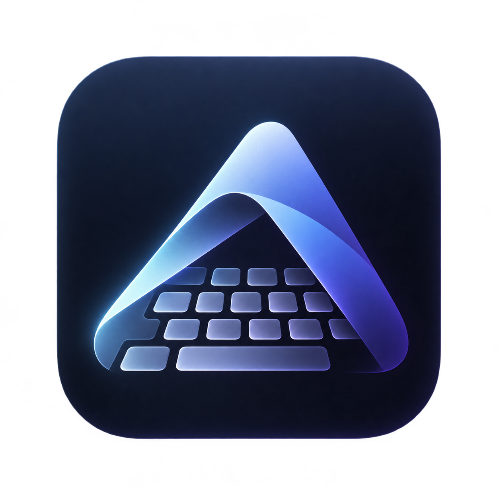

<p align="center">
  
</p>

<h1 align="center">AXIOM ⚡</h1>

<p align="center">
  <b>Turn your dusty tablet into a high-octane, low-latency, cybernetic mechanical split keyboard and precision glass trackpad for Windows.</b>
</p>

<p align="center">
  <i>Because spending $450 on an ergonomic mechanical keyboard when you already own an Android tablet is peak financial irresponsibility.</i>
</p>

<p align="center">
  <a href="#-quick-download--run-the-easiest-way"></a>
  
  
  
</p>

---

## 🧐 What is Axiom?

Let’s be honest: that tablet sitting on your desk is currently either:
1. Playing YouTube videos at 2:00 AM.
2. Collecting dust next to a sticky coffee coaster.
3. Pretending to be useful as a "second monitor" that lags whenever you move a cursor.

**Axiom** solves this by turning your tablet into the ultimate cyberpunk peripheral companion for your Windows PC:
- A **Full Mechanical QWERTY Keyboard** with custom switch audio profiles and reactive RGB ripple effects.
- A **Freeform Ergonomic Split Keyboard** with independent wing sizing, rotatable inward tilt angles, and pinch-to-zoom ergonomics.
- A **Silky Precision Trackpad** with multi-touch gestures, inertial 2-finger scrolling, and dedicated hardware-level click targets.
- **Sub-5ms Ultra-Low Latency** powered by direct UDP binary/JSON packets and Windows native `SendInput` C-level injection. No bloated cloud accounts. No Bluetooth pairing tantrums. No subscription fees.

---

## ⚡ Key Features

### 🦾 1. Ergonomic Split Mode (The Crown Jewel)
* **Independent Wing Sizing**: Got a dominant hand or weird desk arrangement? Scale the Left and Right splits independently anywhere from **50% to 140%**!
* **Touchscreen Pinch-to-Zoom**: Pinch directly on either split with two fingers to resize it instantly on the fly.
* **Custom Tilt & Drag**: Angle the splits inward from 0° to 25° for natural wrist alignment, or drag them anywhere across the screen.
* **Holographic Center HUD**: Arc-reactor status hub with quick-lock adjustments, angle nudging, and persistent flash memory.

### ⌨️ 2. Standard Mechanical Layout
* **Full-Deck QWERTY**: Dedicated Function keys (F1–F12), navigation cluster, Esc, Backspace with smart key repeat, and latchable modifier keys (`Shift`, `Ctrl`, `Alt`, `Win`).
* **RGB Keystroke Ripples**: Dynamic kinetic wave physics radiating outwards from whatever key your finger touches.

### 🖱️ 3. Precision Glass Touchpad
* **Zero-Lag Pointer Glide**: Pixel-accurate cursor tracking with velocity curve acceleration.
* **Direction-Locked Two-Finger Inertial Scrolling**: Smooth glide that never accidentally confuses scroll gestures with right-clicks.
* **Tap-to-Click & Multi-touch**: 1-finger tap to click, 2-finger tap to right-click, plus dedicated physical bottom buttons.

### 🔊 4. Authentic Mechanical Sound Engine
Why type on glass in silence like a caveman? Axiom ships with a high-fidelity sound synthesis engine:
* 🐼 **Holy Panda** (Crisp tactile bump with deep thock)
* 🔵 **Clicky Blue** (Maximum office-neighbor irritation)
* 🧈 **Creamy Linear** (Silky smooth vintage POM keystrokes)
* 🪵 **Thocky Tactile** (Substantial deep acoustic signature)
* 🤖 **Cyber Beep** (Retro 1980s sci-fi terminal chirps)
* 🥷 **Stealth Silent** (For when your boss is walking by)

### 🌈 5. Cyberpunk Neon Themes
* **Cyber Neon** (Cyan & Hot Magenta)
* **Midnight OLED** (Pure Pitch-Black & Electric Blue)
* **Matrix Green** (Phosphor terminal green)
* **Solar Amber** (Warm industrial synthwave)
* **Tokyo Vaporwave** (Dreamy violet & sunset peach)
* **Crimson Fury** (High-alert aggressive red)

---

## 🚀 Quick Download & Run (The Easiest Way)

No need to install Python, Dart, Android Studio, or 400 GB of C++ build tools.

### 💻 Step 1: Run the PC Companion (Windows)
1. Download the standalone executable directly from the repository:
   👉 **[`dist/AxiomDesktop.exe`](dist/AxiomDesktop.exe)**
2. Double click **`AxiomDesktop.exe`**.
3. A sleek black terminal window will pop up showing your **Local IP** and a secure **4-digit PIN** (e.g., `PIN: 1337`).

> *Note: Windows Defender might pop up a prompt saying "Unknown Publisher" because we didn't pay Microsoft $500/year for an EV code-signing certificate. Click **More info → Run anyway**.*

---

### 📱 Step 2: Run the Tablet App (Android)
1. Grab the APK from the [Releases](https://github.com/APEXPRE123207/Axiom/releases) tab (or compile using `flutter build apk`).
2. Open Axiom on your tablet.
3. Tap **CONNECT** at the top:
   - If your tablet is on the same Wi-Fi, it will **auto-discover** your PC!
   - Or type in the PC IP and 4-digit PIN shown on your desktop screen.
4. **Done!** You are now controlling your PC from your tablet.

---

## 🛠️ Building From Source (For Developers & Geeks)

Want to tweak the layout or compile it yourself?

### Prerequisites
* Windows 10/11
* Python 3.10+ (for desktop companion)
* Flutter 3.24+ & Android SDK (for tablet client)

### 1. Run the Desktop Companion
```powershell
cd axiom_desktop
pip install -r requirements.txt
python axiom_desktop.py
```

To compile a standalone `.exe` anytime:
```powershell
.\build_desktop_exe.bat
```

### 2. Run the Tablet App
```powershell
cd axiom_tablet
flutter pub get
flutter run -d <your-tablet-device-id>
```

---

## 💡 Pro-Tips & Gestures

| Gesture | Where | Action |
| :--- | :--- | :--- |
| **Swipe Screen Edge** | Far Left or Right border | Reveals the glowing **Mode Switcher** drawer from anywhere |
| **Two-Finger Pinch** | On either Split (in Move Mode) | Instantly scales that split up or down |
| **Two-Finger Drag** | Anywhere in Touchpad Mode | Smooth inertial vertical / horizontal scrolling |
| **Two-Finger Tap** | Touchpad Surface | Right-clicks at cursor position |
| **Tap Top Bar** | Center Header | Switches between Standard, Ergonomic, and Touchpad |

---

## ❓ FAQ & Troubleshooting

#### Q: *"My tablet didn't vibrate when I pressed a key!"*
> **Hardware reality check**: Did Samsung cheap out and not solder a physical vibration motor into your tablet? Many budget tablets (e.g. Galaxy Tab A 8.0 SM-T290, SM-T510, Tab A7 Lite) **physically do not have a vibration motor**. Axiom queries the native Android hardware HAL directly—if your device has a motor, it delivers crisp 50ms tactile pulses. If it doesn't, blame Samsung's bill-of-materials, not our software.

#### Q: *"Is this safe? Does it send my keystrokes to a server?"*
> **100% Local & Private.** Axiom operates strictly over your local Wi-Fi network using direct UDP socket communication with a salted PIN handshake. Zero telemetry, zero analytics, zero external cloud connections.

#### Q: *"Can I game with this?"*
> Technically yes! Key repeats, simultaneous key combinations, and modifier locks (`Ctrl + Shift + Esc`, `Alt + Tab`, `Win + D`) are fully supported via Win32 `SendInput`.

---

## 📜 License

Distributed under the **Apache 2.0 License**. See [LICENSE](LICENSE) for details.

---

<p align="center">
  <b>Built with ⚡ by <a href="https://github.com/APEXPRE123207">APEXPRE123207</a></b><br>
  <i>Give this repository a ⭐ if it saved you from buying a $300 split keyboard!</i>
</p>
